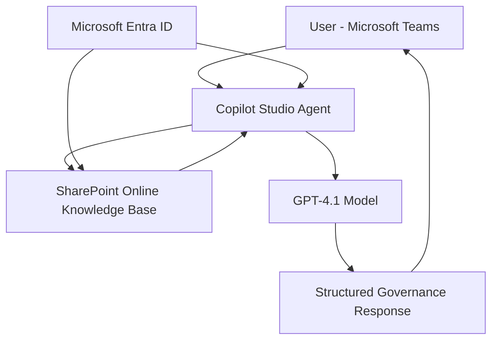
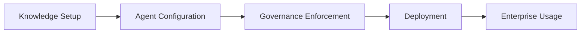

# Metricon-Knowledge-Assistant
Enterprise-grade governance AI Assistant built using a no-code Co-pilot Stack (Microsoft Copilot Studio + Sharepoint + Teams) to enable self-service policy guidance, approvals, and compliance workflows.

## 🚀 Project Overview

### Problem

In enterprise environments, governance artifacts — including policies, templates, forms, and procedures — are distributed across multiple SharePoint sites with inconsistent structure and ownership.

As a result, employees face challenges in:

- Identifying the applicable policy for a given scenario  
- Interpreting complex governance and compliance requirements  
- Understanding approval workflows and escalation paths  
- Executing processes in a compliant and auditable manner  

This leads to systemic issues such as:

- Missed or bypassed approvals  
- Inconsistent interpretation of governance standards  
- High dependency on manual escalation to Risk teams  
- Delays in operational workflows and decision-making  

---

### Why This Matters

- **Governance gaps** → Increased audit exposure and regulatory risk  
- **Inefficient knowledge access** → Loss of productivity at scale  
- **Incorrect execution of processes** → Compliance violations and rework  
- **Over-reliance on Risk teams** → Bottlenecks in business operations  

---

### Target Users

- **New starters** → Require guided, self-service onboarding into governance processes  
- **Business / delivery teams** → Need quick access to correct policies, templates, and approvals  
- **Technology & Risk teams** → Require consistent enforcement of governance standards  
- **Managers / approvers** → Need clarity on decision authority and approval responsibilities  

---

## 🧠 Solution Summary

A **Teams-integrated governance assistant** built using **Microsoft Copilot Studio + SharePoint Online** that:

* Retrieves enterprise policy knowledge
* Generates structured, governance-aligned responses
* Guides users through approvals, forms, and next steps

✔ Fully grounded (no hallucination)
✔ No external data access
✔ Built entirely within Microsoft ecosystem

---

## 🏗️ Architecture

### End-to-End System Flow

1. User asks a governance-related question in Microsoft Teams
2. Copilot Studio agent processes the query
3. Retrieves relevant documents from SharePoint
4. GPT-4.1 generates structured response
5. User receives:

   * Direct answer
   * Relevant documents
   * Required approvals
   * Next steps
   * Governance decision summary

---

### Architecture Diagram

---

### Architecture Components

#### Interface Layer

* Microsoft Teams

#### AI / Agent Layer

* Microsoft Copilot Studio
* GPT-4.1 Model

#### Knowledge Layer

* SharePoint Online

  * ApprovedPolicies
  * Risk Templates
  * Vendor Templates
  * Access Forms
  * Brand Guidelines

#### Security Layer

* Microsoft Entra ID
* Role-Based Access Control (RBAC)

---
## ⚙️ Tech Stack

| Layer            | Technologies Used                          |
|------------------|-------------------------------------------|
| 💻 **Frontend**   | Microsoft Teams                           |
| 🤖 **AI / Agent** | Microsoft Copilot Studio · GPT-4.1        |
| 📂 **Data Layer** | SharePoint Online                         |
| 🔐 **Security**   | Microsoft Entra ID (RBAC)                 |
| ⚡ **Automation** | Power Automate *(Planned / Future Scope)* |

---

### 🔍 Stack Breakdown

- **Microsoft Teams** → Enterprise interface for user interaction  
- **Copilot Studio + GPT-4.1** → Core intelligence & orchestration layer  
- **SharePoint Online** → Source of truth for policies and templates  
- **Microsoft Entra ID** → Authentication & role-based access control  
- **Power Automate** → Workflow automation (approvals, logging, triggers)  

---

### 💡 Why This Stack?

- **100% Microsoft-native** → Seamless integration with enterprise ecosystem  
- **No custom backend required** → Faster deployment, lower maintenance  
- **Secure by design** → Native RBAC + internal data boundaries  
- **Scalable foundation** → Extendable with automation and analytics  

---

## 🔄 End-to-End Workflow

| Phase | Description |
|------|------------|
| 📂 **Knowledge Setup** | Curate and structure governance data in SharePoint |
| 🤖 **Agent Configuration** | Build and connect Copilot Studio agent to knowledge sources |
| 🔒 **Governance Enforcement** | Apply strict grounding and response control mechanisms |
| 🚀 **Deployment** | Publish and scale via Microsoft Teams |

---

### 📂 Phase 1: Knowledge Setup (Source of Truth)

- Establish **ApprovedPolicies** as the canonical governance library  
- Organize supporting repositories:
  - Risk templates  
  - Vendor onboarding templates  
  - Access request forms  
- Enforce:
  - Version control  
  - Ownership (policy owners)  
  - Permission-based access (least privilege)  

👉 **Outcome:** Clean, authoritative, and governed knowledge layer

---

### 🤖 Phase 2: Agent Configuration (Intelligence Layer)

- Create **Technology & Risk Knowledge Assistant** in Copilot Studio  
- Connect **SharePoint Online** as primary knowledge source  
- Configure:
  - Grounded retrieval only (no external sources)  
  - Structured response format (governance-first output)  
- Define system behavior:
  - Policy interpretation rules  
  - Response consistency standards  

👉 **Outcome:** Controlled AI agent with enterprise-aligned behavior
---

### 🔒 Phase 3: Governance Enforcement (Control Layer)

- Implement strict system-level constraints:
  - No external web access  
  - No hallucinated outputs  
  - No retrieval/debug metadata exposure  
- Enforce response structure:
  - Direct Answer  
  - Relevant Artifacts  
  - Required Approvals  
  - Next Steps  
  - Governance Decision Summary  

👉 **Outcome:** AI behaves as a **compliance system**, not a chatbot

---

### 🚀 Phase 4: Deployment (Consumption Layer)

- Publish agent to **Microsoft Teams**  
- Enable enterprise-wide access via secure channels  
- Validate:
  - Role-based access (Entra ID)  
  - SharePoint permission inheritance  
- Rollout to:
  - New starters  
  - Business teams  
  - Risk & Technology stakeholders  

👉 **Outcome:** Scalable, secure, and accessible governance assistant

---

### 🔁 Workflow Summary (Execution View)

---

## 📊 Key Features

* Natural language search across governance documents
* Fully grounded responses
* Governance Decision Summary generation
* Direct artifact linking
* Structured compliance guidance
* Enterprise-grade security
* Zero custom code architecture

---
## 📈 Business Impact

This solution transforms governance from a **reactive, manual process** into a **proactive, self-service system** embedded directly within enterprise workflows.

By combining **grounded AI with structured governance enforcement**, it eliminates ambiguity in policy interpretation, reduces operational friction, and ensures consistent compliance across teams — without increasing dependency on Risk functions.

The impact is measurable across efficiency, risk mitigation, and overall organisational productivity.

---

## 🧪 Challenges & Trade-offs

### Challenge: Policy Sprawl

**Solution:** Centralized ApprovedPolicies library

---

### Challenge: Hallucination Risk

**Solution:** Fully grounded SharePoint-based retrieval

---

### Challenge: Security & Data Leakage

**Solution:** Strict instruction lock + RBAC

---

### Trade-off: No Azure AI Search

**Decision:** Used SharePoint + Copilot

**Reason:**

* Lower cost
* Faster deployment
* Native security

---

## 🔐 Security & Compliance

* Microsoft Entra ID authentication
* SharePoint permission inheritance
* No external data access
* Internal enterprise deployment
* Role-based access control
* Teams-based access interface

---

## 🔮 Future Improvements

* Audit logging (SharePoint list)
* Power Automate approval workflows
* Adaptive cards for form submission
* Vendor risk scoring system
* Governance analytics dashboard
* Access lifecycle automation

---

### Why This Approach

* Native Microsoft ecosystem → secure and scalable
* Grounded AI → eliminates hallucination
* No-code architecture → rapid deployment
* Governance-first design → real business value

---
## Sample Questions to test

Question 1: What happens when an employee changes roles?

Output Explanation: Search → Retrieve → Interpret → Guide

Question 2: Where is the Risk Register Template stored?

User asks → agent finds the right document → explains it → and tells what to do next.
That’s exactly the gap this solution is solving.

This is not just search, it’s guided execution on top of enterprise knowledge.

## 🏆 Key Takeaway

This is not a chatbot.

This is:

* A governance enforcement layer
* A compliance decision engine
* A risk intelligence assistant
* A production-ready enterprise AI system

Built entirely within Microsoft’s secure ecosystem.

---

## 📌 Repository Purpose

This repository demonstrates:

* Enterprise AI architecture design
* Governance-aware system thinking
* Production-ready implementation (no-code)
* Strong alignment with real-world business problems

---
